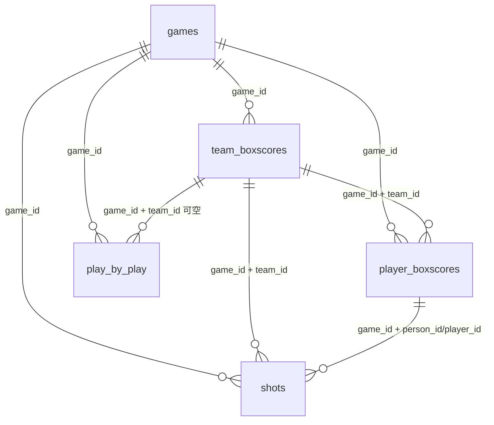

# V2 Database Relationships

Schema relationships only; no records or row counts are included.

```mermaid
erDiagram
    games ||--o{ team_boxscores : "game_id"
    games ||--o{ player_boxscores : "game_id"
    games ||--o{ play_by_play : "game_id"
    games ||--o{ shots : "game_id"
    team_boxscores ||--o{ player_boxscores : "game_id + team_id"
    team_boxscores ||--o{ play_by_play : "game_id + team_id 可空"
    team_boxscores ||--o{ shots : "game_id + team_id"
    player_boxscores ||--o{ shots : "game_id + person_id/player_id"
```

